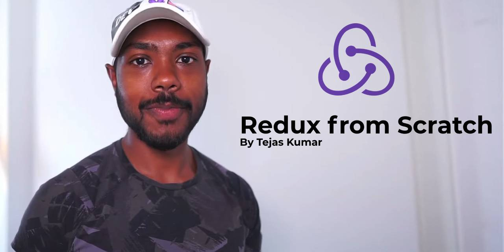

## Code from the [Redux from Scratch](https://www.youtube.com/watch?v=-g1f0j5Qk8A) tutorial by [Tejas Kumar](https://tej.as/)



> This is an unofficial repository accompanying the video by Tejas Kumar. If you like the [video](https://www.youtube.com/watch?v=-g1f0j5Qk8A) please, don't forget to **like** and subscribe to Tejas Kumar's [YouTube Channel](https://www.youtube.com/@tejask) for more amazing content. 

**Note:** it is adviced to go through the video tutorial and code everything yourself from scratch, in order to understand exactly what happens at each step and to improve your coding skills.

**Run tests:**

```bash
npx vitest
```
or

```bash
npm t
```

**Serve index.html**

```bash
npx vite
```

or 

```bash
npm start
```

## How the project was initialized

```bash
npm init -y
npm i -D vitest
```

---

